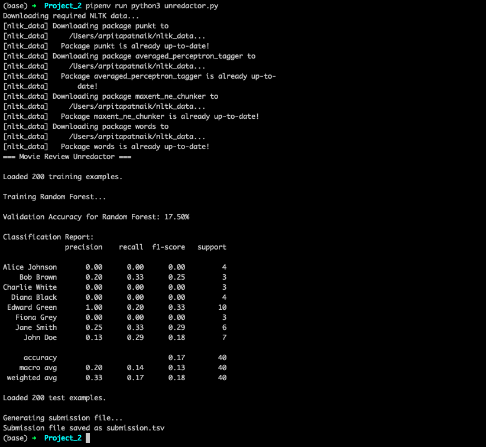

# cis6930fa24 -- Project 2

Name: Arpita Patnaik

# Project Description
This project implements a machine learning-based unredactor system for movie reviews. The system uses a Random Forest classifier to predict redacted names in movie reviews based on contextual features. Find the detailed project description on [https://ufdatastudio.com/cis6930fa24/assignments/project2].

# How to Install
```bash
# Create and activate virtual environment
pipenv install -e .

# Install required packages
pipenv install pandas numpy scikit-learn nltk

# Download required NLTK data
pipenv run python -m nltk.downloader punkt averaged_perceptron_tagger maxent_ne_chunker words
```

# How to Run
To run the unredactor:
```bash
pipenv run python unredactor.py
```

To run the tests:
```bash
pipenv run pytest test_unredactor.py -v
```

# Sample Output
```

```

# Functions

1. `BaseUnredactor.__init__(classifier_name, classifier)`: Initializes base unredactor model with specified classifier.
2. `BaseUnredactor.get_context_features(context)`: Extracts features from text context including:
   - Context length
   - Word count
   - Punctuation presence
   - Capitalization patterns
   - Redaction symbol count
   - Average word length
3. `BaseUnredactor.extract_features(df)`: Generates feature representations for each row in dataset.
4. `BaseUnredactor.fit(train_df)`: Trains model using provided training data.
5. `BaseUnredactor.predict(context)`: Makes prediction for given text context.
6. `BaseUnredactor.evaluate(val_df)`: Assesses model performance using validation data.
7. `RandomForestUnredactor`: Implementation of base unredactor using Random Forest classifier.
8. `load_training_data(file_path)`: Loads and preprocesses training data from TSV file.
9. `load_test_data(file_path)`: Loads and preprocesses test data from TSV file.
10. `generate_submission(model, test_data, output_file)`: Creates submission file with predictions.
11. `main()`: Orchestrates the entire process including:
    - Data loading
    - Model training
    - Evaluation
    - Submission generation

# Bugs and Assumptions

### Assumptions:
1. Training data is provided in TSV format with columns: split, name, context
2. Test data is provided in TSV format with columns: id, context
3. Redacted names in context are marked with █ symbols
4. Context provides sufficient information for name prediction
5. Names in training data are representative of test data

### Known Limitations:
1. Model relies heavily on context features and may struggle with:
   - Unusual or rare names
   - Limited context information
   - Multiple redacted names in same context
2. Feature extraction assumes well-formed input:
   - Valid text strings
   - Proper redaction marking
   - Consistent formatting
3. Error handling for edge cases:
   - Empty strings
   - None values
   - Non-string inputs
   - Malformed data

### Error Handling:
1. Input validation for:
   - None values
   - Empty strings
   - Non-string inputs
   - Invalid file paths
2. Default feature values for invalid inputs
3. Exception handling during:
   - Data loading
   - Feature extraction
   - Model training
   - Prediction generation

